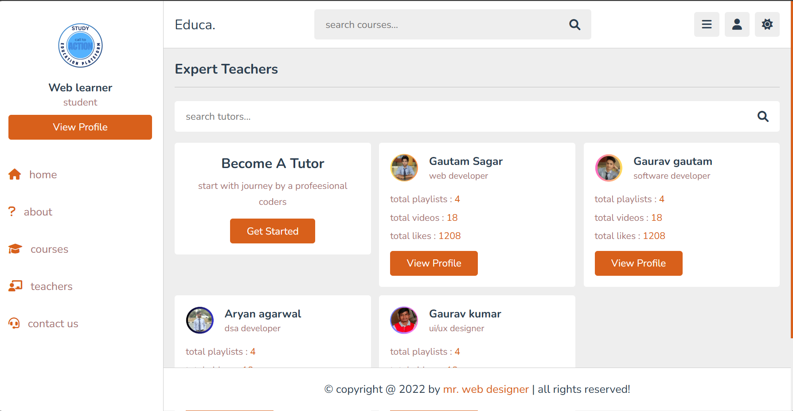

# 📚 EduZone – Modern Educational Platform Website

Welcome to *EduZone, a fully responsive and visually attractive **education platform website* built using only *HTML, CSS, and JavaScript*.

This project is crafted for students, educators, and developers who believe in powerful design + smooth user experience — even without heavy frameworks.

---

## 🚀 Live Demo

👉 [Click here to view the live site]http://(educa-platform.netlify.app )
(Replace with your deployed Netlify/Vercel link)

## 🖼 Screenshots

  
(Add screenshots of homepage, features section, etc.)

---

## ✨ Features

- ✅ Clean and modern homepage layout  
- ✅ Responsive design for mobile, tablet & desktop  
- ✅ Animated sections on scroll  
- ✅ Course cards with hover effects  
- ✅ Navbar with active link highlight  
- ✅ "Join Now" or CTA buttons with smooth transitions  
- ✅ About, Courses, Testimonials & Contact sections  
- ✅ Custom footer with social media icons

---

## 🧰 Tech Stack

| Language | Use |
|----------|-----|
| HTML5 | Page structure |
| CSS3 | Layout, colors, animations |
| JavaScript | Basic interactivity, scroll effects |

---

## 📂 Folder Structure
---

## 🎯 Purpose

> To design a clean, professional education-themed website showcasing courses, mission, and call-to-actions — ideal for portfolios or internship applications.

---

## 🙌 Acknowledgements

This project was built with ❤, and pure frontend code.  
No templates, no frameworks — just dedication & clean code.

---

## 🧑‍💻 Author

*Gautam Royal*  
📧 [Your Email]  
🔗 [Your LinkedIn](www.linkedin.com/in/
gautam-sagar-010119364
)  
🌐 [Your Portfolio (if any)](https://yourportfolio.com)

---

## 📌 Note

If you're a beginner looking to build real-world HTML/CSS projects — feel free to fork or use this as inspiration!